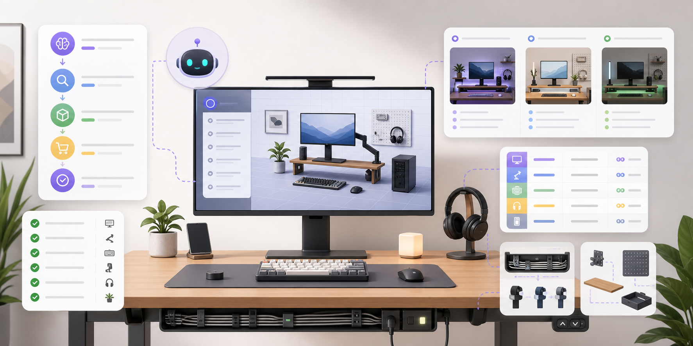
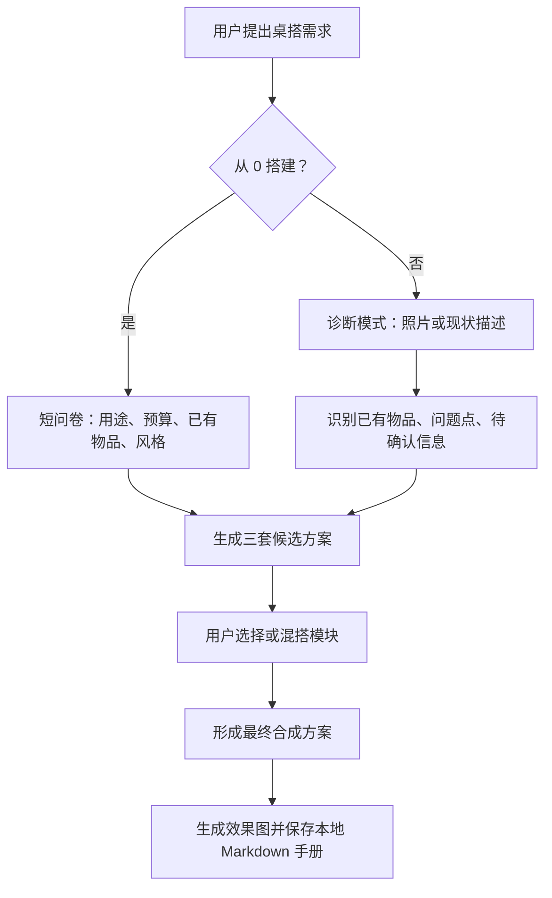

# Desk Setup Planner Skill




一个用于规划、诊断和落地桌搭方案的 Codex skill。它会通过短问卷、照片分析、三套候选方案和多轮取舍，帮助用户整理出可执行的本地 Markdown 桌搭规划手册，并在最终方案确认后生成桌搭效果图。

## 它能做什么

| 能力 | 说明 |
|---|---|
| 从 0 搭建 | 根据用途、预算、已有设备和风格偏好，规划完整桌搭方案 |
| 现有桌面诊断 | 基于描述或整体照片，识别可复用物品、主要问题和优先改造点 |
| 三套候选方案 | 默认给出保守实用、均衡推荐、进阶升级三种方向 |
| 混搭收敛 | 允许用户组合不同方案里的预算、显示器、灯光、收纳或理线模块 |
| 采购与预算 | 输出规格优先的采购清单、预算表、暂缓购买项和核验提醒 |
| 落地执行 | 汇总线缆整理、安装步骤和升级路线，并保存本地 Markdown 手册 |
| 最终效果图 | 用户确认最终方案后，生成桌搭效果图并在手册中引用 |

## 工作流程



## 安装

把 skill 复制到 Codex skills 目录：

```bash
mkdir -p ~/.codex/skills
cp -R desk-setup-planner ~/.codex/skills/desk-setup-planner
```

复制后，通常需要重新打开或刷新 Codex 会话，新的 skill 才会被发现。

## 使用示例

```text
我想改造现有桌面，预算 3000 元。
主要用途：工作 > 游戏 > 影音。
已有：桌子、主显示器、笔记本电脑。
桌子不换，墙面不能打孔。
我会上传当前桌面整体照片。
```

skill 会先补充关键问题，再输出三套候选方案。用户可以选择其中一套，也可以混搭不同方案的模块。最终方案确认后，skill 会生成桌搭效果图，并把规划内容保存成本地 Markdown 手册。

## 输出内容概览

最终手册通常包含：

- 需求与约束
- 三套候选方案回顾
- 最终合成方案
- 采购清单
- 预算表
- 暂缓或不推荐购买清单
- 购买前核验清单
- 线缆整理方案
- 安装步骤
- 升级路线
- 参考图说明
- 本地保存路径

## 边界提醒

- 适合桌搭规划、现有桌面诊断、采购建议、预算拆分、理线、安装步骤和升级路线。
- 不用于完整家装设计、房间装修方案或人体工学专项评估。
- 具体型号、价格、库存、最新参数、地区可得性和售后政策，需要购买前联网核验。
- 不承诺某个品牌或型号一定适合，也不承诺全网最低价。

## 当前状态

这个仓库包含一个可安装的 Codex skill：

- `desk-setup-planner/SKILL.md`
- `desk-setup-planner/agents/openai.yaml`
