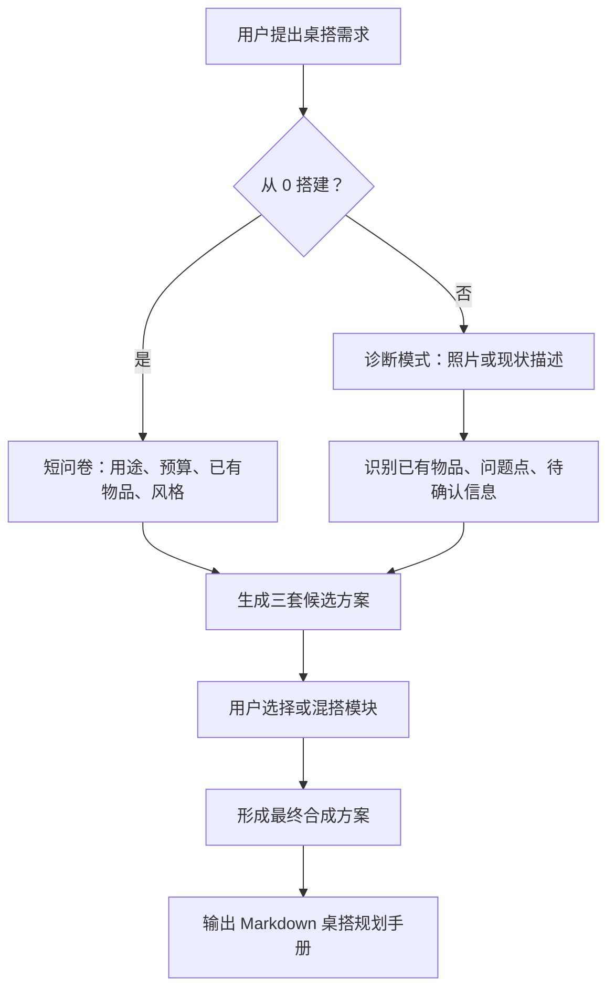

# README Showcase Implementation Plan

> **For agentic workers:** REQUIRED SUB-SKILL: Use superpowers:subagent-driven-development (recommended) or superpowers:executing-plans to implement this plan task-by-task. Steps use checkbox (`- [ ]`) syntax for tracking.

**Goal:** Create a Chinese-first, visually rich `README.md` for the Desk Setup Planner Skill repository and push the current branch to GitHub.

**Architecture:** The README is a single GitHub-facing Markdown document supported by one generated cover image stored under `assets/`. The document presents the skill as a Codex skill project, with badges, a project illustration, a workflow diagram, installation commands, a short usage example, output overview, and concise boundary reminders.

**Tech Stack:** Markdown, Mermaid, Shields.io badge URLs, generated PNG image asset, Git remote/push commands.

---

## File Structure

- Create: `README.md`
  - Main GitHub project page.
  - Chinese-first project showcase.
  - References `assets/readme-cover.png`.
- Create: `assets/readme-cover.png`
  - Product-illustration-style cover image.
  - No required readable text inside the image.
- Modify: Git remote configuration
  - Add `origin` pointing to `https://github.com/douzhenyu/Desk-setup-plannerSkill.git` if missing.

### Task 1: Generate the README Cover Image

**Files:**
- Create: `assets/readme-cover.png`

- [ ] **Step 1: Generate a product-illustration cover image**

Use the built-in image generation tool with this prompt:

```text
Use case: stylized-concept
Asset type: GitHub README cover image
Primary request: Product-illustration-style cover for a Codex skill called Desk Setup Planner Skill.
Scene/backdrop: Clean modern workspace illustration with a desk, monitor, AI planning panel, checklist cards, budget table cards, cable-management hints, and modular planning blocks.
Subject: A tidy desk setup being planned by an AI assistant workflow, emphasizing planning, diagnosis, three candidate options, purchasing checklist, and cable organization.
Style: polished product illustration, modern open-source project aesthetic, clean shapes, subtle depth, balanced composition, soft neutral background with restrained accent colors.
Composition: wide banner-friendly composition, central desk and monitor, floating planning cards around it, no clutter.
Text policy: no readable text, no logo text, no watermark.
Avoid: photorealistic desk photo, messy desk, brand logos, excessive RGB gaming style, unrealistic product labels, illegible generated text.
```

Expected: generated image is suitable as a README cover.

- [ ] **Step 2: Save the selected image into the repository**

Create `assets/` if needed and copy or move the selected generated image to:

```text
assets/readme-cover.png
```

Expected:

```bash
test -f assets/readme-cover.png
```

exits with code 0.

- [ ] **Step 3: Verify the image exists and is a PNG**

Run:

```bash
file assets/readme-cover.png
```

Expected output includes:

```text
PNG image data
```

### Task 2: Write the README

**Files:**
- Create: `README.md`

- [ ] **Step 1: Create `README.md`**

Write this content to `README.md`:

```markdown
# Desk Setup Planner Skill


一个用于规划、诊断和落地桌搭方案的 Codex skill。它会通过短问卷、照片分析、三套候选方案和多轮取舍，帮助用户整理出可执行的 Markdown 桌搭规划手册。

## 它能做什么

| 能力 | 说明 |
|---|---|
| 从 0 搭建 | 根据用途、预算、已有设备和风格偏好，规划完整桌搭方案 |
| 现有桌面诊断 | 基于描述或整体照片，识别可复用物品、主要问题和优先改造点 |
| 三套候选方案 | 默认给出保守实用、均衡推荐、进阶升级三种方向 |
| 混搭收敛 | 允许用户组合不同方案里的预算、显示器、灯光、收纳或理线模块 |
| 采购与预算 | 输出规格优先的采购清单、预算表、暂缓购买项和核验提醒 |
| 落地执行 | 汇总线缆整理、安装步骤和升级路线 |

## 工作流程



## 安装

把 skill 复制到 Codex skills 目录：

```bash
mkdir -p ~/.codex/skills
cp -R desk-setup-planner ~/.codex/skills/desk-setup-planner
```

复制后，通常需要重新打开或刷新 Codex 会话，新的 skill 才会被发现。

## 使用示例

```text
我想改造现有桌面，预算 3000 元。
主要用途：工作 > 游戏 > 影音。
已有：桌子、主显示器、笔记本电脑。
桌子不换，墙面不能打孔。
我会上传当前桌面整体照片。
```

skill 会先补充关键问题，再输出三套候选方案。用户可以选择其中一套，也可以混搭不同方案的模块，最后汇总成一份 Markdown 桌搭规划手册。

## 输出内容概览

最终手册通常包含：

- 需求与约束
- 三套候选方案回顾
- 最终合成方案
- 采购清单
- 预算表
- 暂缓或不推荐购买清单
- 购买前核验清单
- 线缆整理方案
- 安装步骤
- 升级路线
- 参考图说明

## 边界提醒

- 适合桌搭规划、现有桌面诊断、采购建议、预算拆分、理线、安装步骤和升级路线。
- 不用于完整家装设计、房间装修方案或人体工学专项评估。
- 具体型号、价格、库存、最新参数、地区可得性和售后政策，需要购买前联网核验。
- 不承诺某个品牌或型号一定适合，也不承诺全网最低价。

## 当前状态

这个仓库包含一个可安装的 Codex skill：

- `desk-setup-planner/SKILL.md`
- `desk-setup-planner/agents/openai.yaml`
```

- [ ] **Step 2: Verify README references the cover image**

Run:

```bash
rg -n "assets/readme-cover.png|flowchart TD|mkdir -p ~/.codex/skills|不承诺全网最低价" README.md
```

Expected: all four patterns appear.

### Task 3: Validate README and Repository State

**Files:**
- Read: `README.md`
- Read: `assets/readme-cover.png`
- Read: `docs/superpowers/specs/2026-06-02-readme-showcase-design.md`

- [ ] **Step 1: Check files exist**

Run:

```bash
test -f README.md && test -f assets/readme-cover.png
```

Expected: command exits with code 0.

- [ ] **Step 2: Check README requirements**

Run:

```bash
rg -n "Codex Skill|Desk Setup Planner Skill|它能做什么|工作流程|安装|使用示例|输出内容概览|边界提醒|不用于完整家装设计|不承诺全网最低价" README.md
```

Expected: all patterns appear.

- [ ] **Step 3: Check for incomplete marker words**

Run:

```bash
rg -n "T[B]D|T[O]DO|F[I]XME|待[ ]定|暂[ ]定|以后[ ]补|fill[ ]in|place[ ]holder" README.md
```

Expected: no matches.

- [ ] **Step 4: Commit README and cover asset**

Run:

```bash
git add README.md assets/readme-cover.png docs/superpowers/plans/2026-06-02-readme-showcase.md
git commit -m "Add README showcase"
```

Expected: commit succeeds.

### Task 4: Configure Remote and Push

**Files:**
- Modify: repository Git remote config only.

- [ ] **Step 1: Check current remotes**

Run:

```bash
git remote -v
```

Expected: either no output or an existing `origin`.

- [ ] **Step 2: Add or update `origin`**

If no `origin` exists, run:

```bash
git remote add origin https://github.com/douzhenyu/Desk-setup-plannerSkill.git
```

If `origin` exists but points elsewhere, run:

```bash
git remote set-url origin https://github.com/douzhenyu/Desk-setup-plannerSkill.git
```

Expected: `git remote -v` shows:

```text
origin	https://github.com/douzhenyu/Desk-setup-plannerSkill.git (fetch)
origin	https://github.com/douzhenyu/Desk-setup-plannerSkill.git (push)
```

- [ ] **Step 3: Push the current branch**

Run:

```bash
git push -u origin codex/desk-setup-planner
```

Expected: push succeeds. If authentication fails, report the failure and leave local commits intact.

## Self-Review Checklist

- [ ] The plan includes the generated cover image asset.
- [ ] The plan includes a Chinese-first README with badges, cover image, workflow diagram, installation, short example, output overview, and boundary reminders.
- [ ] The plan avoids a directory structure section.
- [ ] The plan avoids the full handbook template.
- [ ] The plan does not imply the skill is already globally installed.
- [ ] The plan includes GitHub remote configuration and push.
- [ ] The plan includes concrete verification commands.
